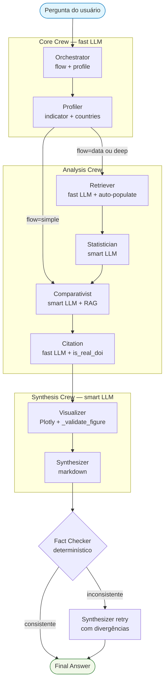

# Sistema de agentes (CrewAI)

Substitui o antigo [`crewai-arch.jsx`](crewai-arch.jsx) em formato texto +
Mermaid.

## Fluxo principal — `master_flow.run_master(question)`



## Agentes — papel e LLM

| Agente | Crew | LLM | Output | Tools |
|---|---|---|---|---|
| Orchestrator | Core | fast | `IntentDecision` (flow, profile) | — |
| Profiler | Core | fast | `EntityExtraction` (indicator, countries, year) | — |
| Retriever | Analysis | fast | `RetrievedData` (primary_data, primary_meta) | 4 data tools |
| Statistician | Analysis | smart | `StatAnalysis` (key_metrics, focus_country_position) | ComputeStatsTool |
| Comparativist | Analysis | smart | `ComparativeContext` (narrative, key_findings) | RAGSearchTool |
| Citation | Analysis | fast | `Citations` (lista DOI + metadata) | RAGSearchTool + CiteResolveTool |
| Visualizer | Synthesis | fast | `VizSpec` (Plotly figure dict) | MakePlotlySpecTool |
| Synthesizer | Synthesis | smart | `FinalAnswer` (markdown adaptado a perfil) | — |
| Fact Checker | — (Python puro) | — | `(is_consistent, divergences)` | — |

`smart` ↔ qwen2.5:32b · `fast` ↔ qwen2.5:14b (configurável — ver
[`../operations/models-and-providers.md`](../operations/models-and-providers.md)).

## Três fluxos de execução

| Fluxo | Quando | Path | Tempo típico |
|---|---|---|---|
| `simple` | Pergunta conceitual sem números | Core → Comparativist → Citation → Synthesis | ~3 min |
| `data` ★ | Pergunta com dados numéricos | Core → Analysis completo → Synthesis | **~20 min** |
| `deep` | Análise causal/multifator | Idem `data` com `max_iter` maior (Sprint 5.6 trata = data) | ~25 min |

## Guardrails determinísticos

Implementados no pipeline para mitigar limitações dos LLMs locais:

| Guardrail | Onde | Função |
|---|---|---|
| **Auto-populate Retriever** | `analysis_crew._autopopulate_primary_data` | Re-executa tool via `EduGatewayClient` quando `primary_data=[]`. ADR 0006. |
| **`is_real_doi`** | `tools/rag_tools.py` + `analysis_crew._run_citation` | Rejeita DOIs `10.xxxx/...`, `placeholder`, etc. Zera `cit.doi` mas mantém title/authors. |
| **`_validate_figure`** | `tools/viz_tools.py` | Plotly figure: rejeita `x`/`y` como string serializada. |
| **`check_numeric_consistency`** | `crews/_helpers.py` | Extrai números do markdown e cruza com `primary_data` + `key_metrics`. Tolerância 5%. |
| **Fact Checker + retry** | `master_flow` (passo 4) | Se >20% divergentes, dispara Synthesizer (retry) com divergências; warning visível se falhar de novo. |
| **RAG vazio** | `analysis_crew._run_citation` | Se `rag_client.count()==0`, devolve `Citations(items=[], notes=[...])` honesto. |

## Output shape (`FinalAnswer`)

```json
{
  "markdown": "# Título\n\n...",
  "profile_used": "researcher" | "policy" | "student",
  "flow_used": "simple" | "data" | "deep",
  "sources_cited": ["worldbank", "unesco"],
  "visualizations": [{
    "chart_type": "bar_vertical" | "bar_horizontal" | "line_multi" | "none",
    "title": "...",
    "plotly_figure": {"data": [...], "layout": {...}},
    "sources": ["worldbank"],
    "notes": ["..."]
  }],
  "citations": [{
    "doi": "10.1162/REST_a_00081" | null,
    "title": "...",
    "authors": ["..."],
    "year": 2011,
    "snippet": "..."
  }],
  "warnings": ["..."],
  "follow_up_suggestions": ["...", "..."]
}
```
