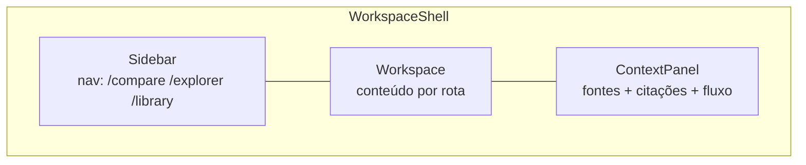
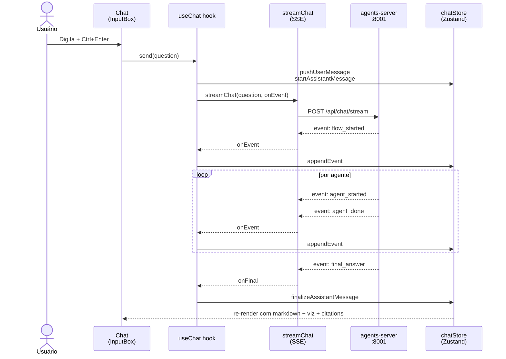

# Frontend (Next.js 14)

Substitui o antigo [`frontend-arch.jsx`](frontend-arch.jsx). Stack:
- Next.js 14 (App Router) + TypeScript strict
- Tailwind 3.4 + shadcn/ui (cópia local)
- Zustand (estado global) + TanStack Query v5 (cache HTTP)
- react-markdown + react-plotly.js (chunk lazy)
- Vitest (77 testes unit) + Playwright (9 testes E2E)

## Layout — workspace 3 colunas



Estrutura unificada em [`components/layout/WorkspaceShell.tsx`](../../frontend/components/layout/WorkspaceShell.tsx)
(antes duplicado em 3 page.tsx — ver [ADR 0008](../adrs/0008-dry-refactor-pass.md)).

## Fluxo de uma pergunta (rota `/compare`)



## Componentes principais

| Componente | Responsabilidade |
|---|---|
| `Chat.tsx` | Header (perfil pills) + lista de mensagens + InputBox |
| `InputBox.tsx` | textarea + Ctrl+Enter + autosize |
| `MessageBubble.tsx` | Renderiza mensagem (user/assistant) — agrupa reasoning, markdown, viz, citations |
| `AgentReasoning.tsx` | Timeline collapsável dos eventos `agent_started/done` |
| `StreamingMarkdown.tsx` | react-markdown + remark-gfm para markdown em streaming |
| `InlineChart.tsx` | Wrapper de Plotly com lazy load + ErrorBoundary |
| `CitationPanel.tsx` | Lista de citações no corpo da mensagem |
| `DoiLink.tsx` | Link clicável para doi.org (variantes icon/text) |
| `ContextPanel.tsx` | Painel direito persistente — perfil, fontes, citações resumidas |
| `DataExplorer.tsx` | Lista de marts Gold (consome `/api/data/catalog`) |
| `WorkspaceShell.tsx` | Shell 3 colunas reutilizado em `/compare`, `/explorer`, `/library` |

## Estado global (Zustand)

```typescript
// chatStore.ts
{
  messages: ChatMessage[],
  currentAssistantId: string | null,
  pushUserMessage(content): void,
  startAssistantMessage(id): void,
  appendEvent(id, event): void,
  finalizeAssistantMessage(id, final): void,
}

// profileStore.ts
{
  profile: 'researcher' | 'policy' | 'student',
  setProfile(p, manual?): void,   // manual=true sobrescreve auto-detect
}
```

Auto-detecção de perfil: a primeira resposta da Core Crew (event
`agent_done` com `agent: 'Core (...)'`) inclui `result.profile`. O
`useChat` hook chama `setProfile(detected)` se não foi setado manualmente.

## Cliente HTTP

[`lib/api-client.ts`](../../frontend/lib/api-client.ts) — `apiGet` / `apiPost`
com base URL configurável via `NEXT_PUBLIC_API_BASE_URL` (default
`http://localhost:8000`). Em produção via Caddy reverse proxy single origin.

Tipos do gateway gerados automaticamente:

```bash
cd frontend
npm run gen:api-types            # fetch live OpenAPI
npm run gen:api-types:snapshot   # do snapshot versionado
```

## Build e deploy

```bash
cd frontend
npm run dev                      # http://localhost:3000 com HMR
npm run build && npm start       # produção
npm test                         # vitest unit (77)
npm run test:e2e                 # playwright (9 E2E)
```

Em produção, **Caddy reverse proxy** em `:8443` consolida `:3000`,
`:8000`, `:8001` numa única origem. Resolve CORS + HTTPS automático.
