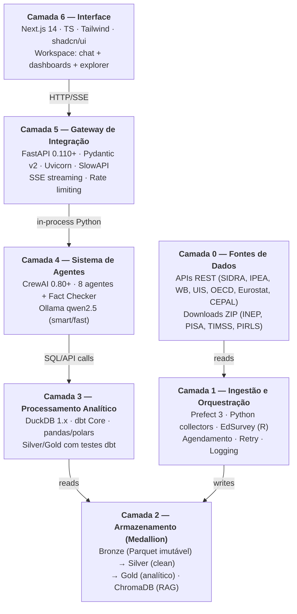

# Camadas do sistema

Visão estática das 6 camadas + camada 0 (fontes externas). Substitui
o conteúdo do antigo [`edu-arch.jsx`](edu-arch.jsx) em formato texto.



## Por camada

### Camada 0 — Fontes de dados externos

40+ bases mapeadas em [`../references/data-sources.md`](../references/data-sources.md).
Combina:
- **APIs REST maduras** (IBGE SIDRA, IPEADATA OData, World Bank, UNESCO UIS,
  Eurostat JSON-stat, OECD SDMX, CEPALSTAT) — ingestão programática.
- **Downloads em lote** (INEP microdados, PISA/TIMSS/PIRLS SPSS) — ZIPs anuais.
- **Repositórios** (Base dos Dados via BigQuery, GitHub llece/erce).

### Camada 1 — Ingestão e orquestração

`data_pipeline/src/collectors/<fonte>/` — cada coletor herda de
[`BaseCollector`](../../data_pipeline/src/collectors/base.py) e implementa:
- `build_url(period)` — resolução da URL para o período.
- `fetch(...)` — usa `_http_fetch_json` ou `_http_fetch_paginated` da base.
- Schema canônico de saída (parquet em `data/bronze/<fonte>/<ano>/`).

Flows Prefect em `data_pipeline/src/flows/` agendam coletas. Manutenção
e retries automáticos.

### Camada 2 — Armazenamento Medallion

```
data/
├── bronze/      Parquet por fonte+ano (imutável — nunca modificado)
├── silver/      (Histórico Delta — hoje vive em DuckDB main_intermediate)
├── gold/        (Histórico Parquet — hoje vive em DuckDB main_marts)
├── chromadb/    Vector store p/ RAG (25 papers seed)
└── duckdb/      education.duckdb (~5 MB)
```

ChromaDB é a base do **Retrieval-Augmented Generation** consumido pelo
Citation Agent e Comparativist.

### Camada 3 — Processamento analítico

**dbt Core + adapter dbt-duckdb**. Modelos em `dbt_project/models/`:
- `staging/` — 1:1 com Bronze, tipagem e renomeação.
- `intermediate/` — joins, ISCED 2011, harmonização ISO-3.
- `marts/` — 5 marts analíticos finais com testes.

Toda Gold tem `not_null` em chaves primárias e range plausível em métricas.
`dbt build` roda 137 testes.

### Camada 4 — Sistema de agentes (CrewAI)

Ver [`agents.md`](agents.md) para detalhe. Resumo:
- **Core Crew** (Orchestrator + Profiler) — roteamento, fluxo, perfil.
- **Analysis Crew** (Retriever + Statistician + Comparativist + Citation) — dados + análise + literatura.
- **Synthesis Crew** (Visualizer + Synthesizer) — figure dict + markdown final.
- **Fact Checker** (determinístico) — valida números do markdown vs `primary_data`.

### Camada 5 — Gateway FastAPI

`api/src/routers/`:
- `data.py` — `/api/data/{catalog,timeseries,compare,ranking}`
- `health.py` — `/api/health`

Mais: `agents-server` (em `agents/src/server/`) na porta 8001 expõe
`/api/chat/stream` (SSE) e proxia ao master flow CrewAI.

### Camada 6 — Frontend Next.js 14

`frontend/app/` — App Router, 3 colunas (Sidebar + Workspace + ContextPanel).
Rotas:
- `/compare` — chat de análise comparada.
- `/explorer` — explorador de marts Gold.
- `/library` — biblioteca de citações.

Cliente HTTP em `frontend/lib/api-client.ts`. Tipos gerados via
`openapi-typescript` do schema OpenAPI do gateway.
