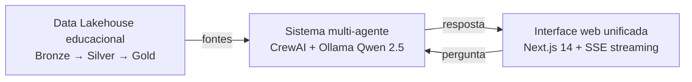

# Overview do sistema

> Sistema acadêmico de análise comparada **Brasil × Internacional** em
> educação básica. Combina Data Lakehouse + multi-agente CrewAI + frontend
> Next.js, 100% open source, on-premise.

## Pergunta central

**"Como a educação básica brasileira se compara à educação dos países
desenvolvidos?"**

O sistema responde decompondo perguntas em natural language, recuperando
dados de 7 fontes oficiais consolidadas em 5 marts Gold, executando
análise estatística + narrativa fundamentada em literatura científica
(RAG com 25 papers seed), e renderizando markdown + Plotly + citações
DOI adaptados ao perfil do usuário.

## Três componentes integrados

Detalhes:
- **Lakehouse:** [`layers.md`](layers.md) (camadas 0-3)
- **Agentes:** [`agents.md`](agents.md) (camada 4)
- **Frontend:** [`frontend.md`](frontend.md) (camada 6)
- **Gateway FastAPI:** camada 5, ver [`layers.md`](layers.md#camada-5--gateway-fastapi)

## Público-alvo

O Orchestrator detecta automaticamente 1 de 3 perfis e adapta o estilo:

| Perfil | Estilo da resposta |
|---|---|
| **researcher** (pesquisador/acadêmico) | Linguagem técnica, z-scores, percentis, DOIs expandidos, sem emojis |
| **policy** (gestor público) | Foco em decisão, PNE meta 20, recortes territoriais, números arredondados |
| **student** (estudante) | Linguagem informal, glossário inline, analogias, convite a aprofundar |

Cada perfil tem tema visual sutil no frontend (`ProfileTheme.tsx`).

## Contexto do desenvolvimento

- **Infraestrutura:** on-premise, servidores próprios (Ubuntu 22.04 LTS)
- **Equipe:** solo developer (projeto acadêmico)
- **Orçamento de infra:** R$ 0 além do servidor (tudo open source)
- **Hardware mínimo:** 16 GB RAM, 4 cores CPU, 500 GB SSD
- **Hardware recomendado:** 32 GB RAM, 8+ cores CPU, 1-2 TB SSD
  (suficiente para rodar `qwen2.5:32b` em CPU offload — [ADR 0005](../adrs/0005-ollama-qwen-provider.md))

## Princípios inegociáveis

Em ordem de prioridade, em caso de conflito:

1. **Rigor acadêmico acima de velocidade** — resultados estatisticamente
   inválidos são piores que nenhum resultado.
2. **Reprodutibilidade total** — toda transformação versionada no Git;
   dbt obrigatório.
3. **Imutabilidade da camada Bronze** — dados brutos nunca são alterados.
4. **Plausible Values corretos** — PISA/TIMSS/PIRLS exigem BRR/Jackknife.
   Detalhes em [`../methodology.md`](../methodology.md#plausible-values).
5. **Transparência da fonte** — toda resposta ao usuário mostra de onde
   vieram os dados (`sources_cited`, `citations`, `warnings` no FinalAnswer).
6. **Copyright e ética** — citar todas as fontes, respeitar licenças.

## Stack tecnológico

### Backend (camadas 1-5)

| Camada | Tecnologia |
|---|---|
| Ingestão | Prefect 3 · httpx · pandas/pyarrow · pyreadstat · EdSurvey (R) |
| Storage | DuckDB 1.x · Parquet · PostgreSQL 16 · ChromaDB |
| Transformação | dbt Core + dbt-duckdb |
| Agentes | CrewAI 0.80+ · LiteLLM (provider-agnóstico) · sentence-transformers |
| Gateway | FastAPI 0.110+ · Pydantic v2 · Uvicorn · SlowAPI |
| Observabilidade | structlog · OpenTelemetry (opcional) · Langfuse (opcional) |

### Frontend (camada 6)

| Função | Tecnologia |
|---|---|
| Framework | Next.js 14 (App Router) + TypeScript strict |
| Estilo | Tailwind 3.4 + shadcn/ui (cópia local) |
| Estado | Zustand + TanStack Query v5 |
| Visualizações | Plotly.js (react-plotly.js lazy) |
| Markdown | react-markdown + remark-gfm |
| Testes | Vitest (77 unit) + Playwright (9 E2E) |

### Deploy

- Docker + Docker Compose (orquestração)
- Caddy reverse proxy single origin (`:8443` em produção)
- Git + (Gitea self-hosted opcional)

## Estado atual (2026-05-16)

| Subsistema | Status |
|---|---|
| Bronze (7 fontes) | ✅ ~3,2 M linhas em Parquet |
| Silver (DuckDB intermediate) | ✅ 5 tabelas, ~5,3k linhas |
| Gold (DuckDB marts) | ✅ 5 marts, 1.182 linhas |
| dbt tests | ✅ 137/137 passando |
| API FastAPI | ✅ 4 endpoints, OpenAPI completo |
| Agents CrewAI | ✅ 8 agentes + Fact Checker, fluxos simple/data/deep |
| RAG ChromaDB | ✅ 25 papers seed indexados |
| Frontend Next.js 14 | ✅ workspace funcional, SSE streaming |
| Testes Python | ✅ 105/105 |
| Testes JS | ✅ 77/77 |

## Documentação relacionada

- [`layers.md`](layers.md) — 6 camadas + camada 0 detalhadas
- [`agents.md`](agents.md) — sistema CrewAI completo
- [`frontend.md`](frontend.md) — Next.js workspace
- [`../methodology.md`](../methodology.md) — plausible values, ISCED, copyright
- [`../conventions.md`](../conventions.md) — Python/TS/Git/SQL
- [`../operations/`](../operations/) — como rodar e operar
- [`../adrs/`](../adrs/) — decisões arquiteturais
- [`../references/data-sources.md`](../references/data-sources.md) — catálogo de 40+ bases
